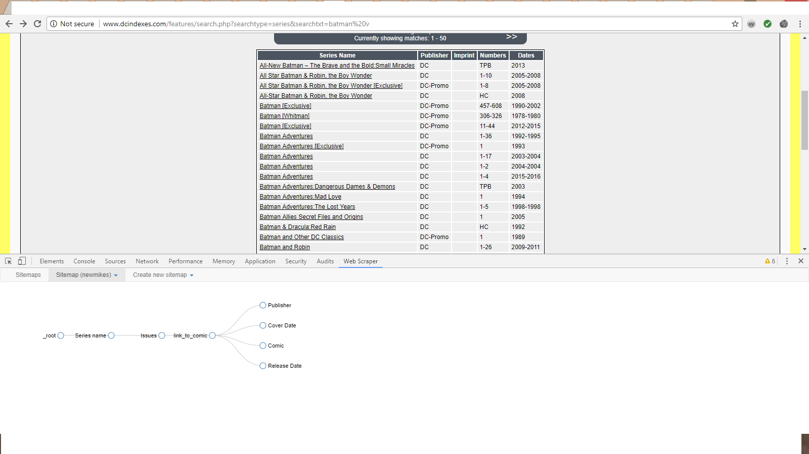

# The Databases
### [Mike's Amazing Comics](http://www.dcindexes.com/)
Mike's was the first database that we looked at for our project. We began by searching for some comic books of the Marvel publsiher, but found that the results were somewhat lacking. Before giving up on the site we also searched for the DC publisher and uncovered an extensive list of entries. Upon further investigation we found that the creator of the database had intended the database to be comprehensive for all comic books, but at the time he did not have the time or money to complete the effort. Instead, he focused his efforts on DC because they are his favorite publisher. The about me page on the site revealed much about Mike's motivations. Mike is a professional web developer and he built the database by himslef during his free time. His sole purpose for the site is his love of comic books that he developed as a child. Mike does not seem to make money off of his database and there is a fair amount of transparency with the site. He admits that local collectors have helped him obtain comics for the database.

### [Comic Book DB](http://www.comicbookdb.com/)
Our second database was Comic Book DB and at first glance we believed that it had all the information we would need. The site includes a colossal amount of comic book entries. It also includes elements such as price, page count, and series information. This all seemed to good to be true and we came to understand that it was a red herring. The site is difficult to use with only a handful of options available to narrow search results. In addition many of the great features such as price and page count were entered into the site in such a way that it made them impossible to web scrape. The site also has a tendency to crash or simply be unavailable for days at a time. This impeded our research, but we could not pass up the valuable data that the site contained. There are some questions as to the motivations behind the creators of the website. There is no true about me section on the site and it seems that anyone can make changes to the database. It operates in a fashion that is very similar to Wikipedia. This calls the data present into question, but upon review we dertimed that the entries on Batman were accurate in the aggregate. The site also states that they do not like users to gather data from the site, so we will be unable to post any raw data that we collected. We asked the administrators of the site for more information, but they have yet to respond. We were unable to ascertain the motivations behind the creation of the database and we are unsure if it is monetized in any fashion. This site is very opaque with its methods of creation and operation and we must keep that in mind when examing the data collected from this site.
