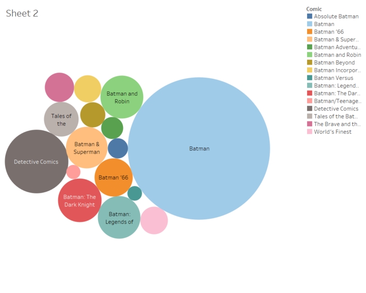
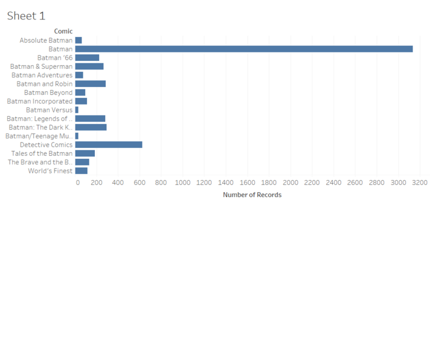
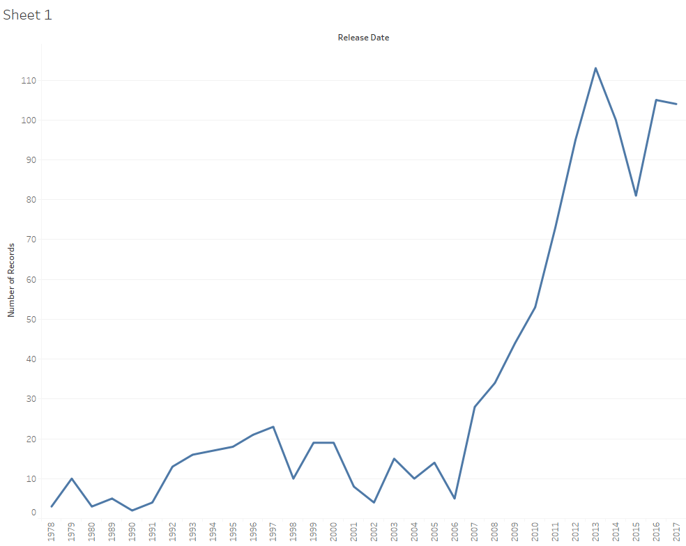
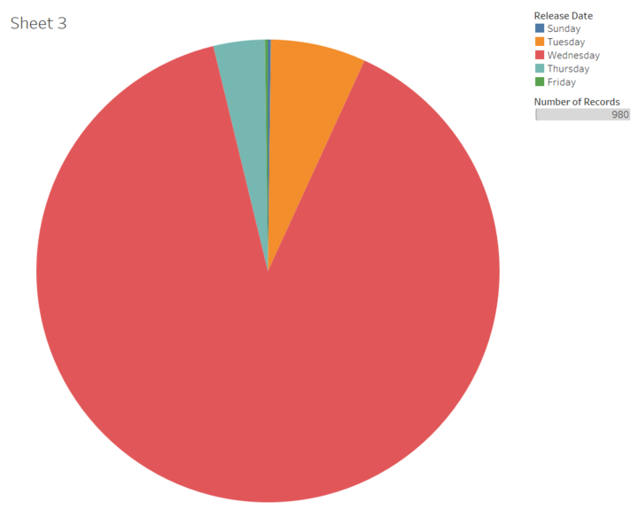

# Visualizations
In the visualizations for our pilot project I decided to create several graphs and charts to help show what different series are most popular, and where the character of Batman shows up most often.  I also decided to try and chart out when these comics are released, and how the number has changed over time.

Some of the problems I ran into in the beginning was having to clean up some of the data that we got from comicbookdb.com.  Some of the series titles were entered in inconsistently, with spaces or dashes, but openrefine was very helpful in solving those issues.  I ended up combining a lot of different series into categories that I could work with, so the data I used was very generalized.  Otherwise we’d be dealing with about 10,000 one-off series, and visualizing that would have been a nightmare.  I’m also using a sample of the data we got off of openrefine, and excluded one-off titles that I couldn’t easily categorize into one of the other brackets.  I only wanted to look at the most common titles for this exercise.
	After separating the series into categories, I wanted to find out what the most popular title for a comic Batman appears in is.  To no one’s surprise the title Batman most often appears in is simply Batman, by a wide margin.  Who would have thought?  The next one after that was Detective Comics, which was the series Batman originally appeared in in 1939, and is also what the “DC” in DC comics stands for.  The series began in the same year, and featured a number of short detective stories at first.  The cover of the first issue features a potentially racist Chinese character named Ching Lung.  The Bat-man first appeared in issue #27 of this run, as a rich playboy who’d lost his parents in a mugging and decided to dress as a bat and solve crimes, and an original copy of Detective Comics #27 sold for over one million dollars in February 2010.  The third most popular series was Batman: The Dark Knight, named after one of the popular nicknames that Batman has earned over the years.  Others include “The caped crusader,” “the World’s greatest detective,” or simply “Batsy” which the Joker has become rather fond of calling him.  Next on the list were series titles Batman & Robin featuring Batman and his sidekick Robin “the Boy Wonder.”  The first appearance of Robin was in Detective Comics # 38, as Dick Grayson, a circus performer whose parents had been killed in an apparent accident, and had been taken in by the reclusive billionaire Bruce Wayne.  Since then there have been 4 other “Robins” (Tim Drake, Jason Todd, Carrie Kelly, and Bruce’s son Damien Wayne).  I didn’t have the resources or the data to find out which of these Robins Batman spent the most time with, but that would be a good question to ask going forward if we continued with this project.  If I had to guess, I’d say Dick.
	The most common Batman crossover unsurprisingly comes from the other major face of DC comics, Superman, with almost as many Batman & Superman issues in this dataset as there were Batman and Robin issues.  Superman first appeared on shelves in Action Comics #1, with the cover image being the man himself lifting a car!  Superman would be another fascinating character to look at throughout the years if this project went any further, and interactions between the two characters in Superman primary titles aren’t included in this dataset.
	A couple of other things to note are a few interesting categories on the graph.  First is the Batman ’66 series, which began in 2013, and is based off the television series from 1966 starring Adam West and Burt Ward.  The series has had a number of notable crossovers from other popular shows from the time, including Batman ’66 Meets the man from U.N.C.L.E. and Batman ’66 meets Wonder Woman ’77.  All are, I’m sure, great reads.  Batman ’66 isn’t the only series in this dataset based off popular television shows.  Another interesting series that showed up frequently was Batman Beyond, based off of the animated series of the same name.  The series is set in cyberpunk-inspired near future, after Bruce Wayne has retired, and teenager Terry McGinnis takes up the mantel as the new Batman.  Though not as numerous, Batman: The Brave and the Bold is also based on a more recent animated television series, featuring Batman, and with many appearances from other DC heroes, such as Aquaman, Powergirl, Lex Luthor, and Brother Power the Geek.  This series was eventually renamed The All New Batman: The Brave and the Bold, so I had to change the title in openrefine of the newer issues, so I could get them all into one category.  One last thing I’ll discuss for this first graph is the Batman Versus column, devoted to any and all Batman comics that feature “Batman vs. someone” in the title, excluding Superman.  All Superman mentions were in the Batman & Superman category listed above.  The list of character who have featured in the title after “Batman versus” has included Bane, the Incredible Hulk (in a DC Marvel crossover series), Spawn, Dracula, the Predator, and Alien (from the Ridley Scott series of films).

In another chart, we decided to graph out the release dates of Batman issues between 1978 and 2017, and came up with an interesting spread.  While 1979 was a solid year, peaking at 10 issues, there isn’t much in this dataset from the 1980’s.  This may be because the data isn’t complete, but it seems like the 1980’s was a slow time for Batman in comic books.  The number of issues begins to rise in the 1990’s, as Batman begins to be featured in several movies and television shows, such as Batman (1989), Batman Returns, Batman Forever, and Batman: The Animated Series.  This gradual rise holds steady, until it peaks in 1997, the same year as the disastrous Batman and Robin movie, which currently has a 10% on rotten tomatoes.  This probably led to a drop in sales, which led to the number of Batman issues the next year to be cut in half.  The amount of issues released would recover over time, but Batman wouldn’t see the amount of exposure he’d enjoyed in 1997 for another decade.  Christopher Nolan’s Batman Begins came out in 2005, and it would be reasonable to expect the number of Batman issues to increase in the next year, but 2006 again sees a drop in the amount of Batman series released.  2007, however, is a different story.  The amount of Batman series nearly doubled in 2007, and after the release of The Dark Knight (2008) the sequel to Batman Begins, the number of Batman appearances sky-rocketed, peaking at over 100 in 2013, the year after the finale of the Christopher Nolan trilogy The Dark Knight Rises saw theaters.  A sharp decline in 2015 was met by an almost just as sharp increase in the next year.  This could be caused by a number of factors, such as the release of the highly-anticipated Batman vs. Superman, or DC comics own Rebirth, where the DC staff rebooted their comic universe again, ending the stagnating New 52, which had launched in 2011.  A combination of the two is more likely.

For my final chart, I decided to look at which day of the week most of the Batman comics are released on, and unsurprisingly found that Wednesday was the day roughly 90% of the Batman comics in this database were released.  As a comic book reader, myself, I’ve often experienced the glow of a comic book shop on a Wednesday, browsing all the new releases, but I never really knew why it was that new comics dropped in the middle of the week.  Well, I did a little bit of research, and wasn’t able to come up with much as to why Wednesday was the day comics came out, but I did come up with something fascinating.  It turns out that none of the major Comic book publishers actually distribute their own print material anymore.  In fact, one company, Diamond Comics Distribution, has exclusive distribution rights for all comics in print in North America published by DC Comics, Marvel Comics, Dark Horse Comics, Image Comics, and IDW Publishing.  Basically, every major comic book publishing company runs distribution through Diamond Comics Distribution since 1997.  The apparent monopoly on all comic book distribution led to the U.S. Justice Department to get involved, with the Baltimore Business Journal reporting that the federal government launched an anti-trust investigation into the distributor in 1997 , but the investigation ended in 2000, after the Justice Department concluded it couldn’t be considered a monopoly since Diamond Comics Distribution only distributed comics, and not actual books.  Chuck Rozanski, owner of Mile High Comics, was asked to testify to the Justice Department as part of the investigation, and was quoted after the fact:
“It was on that fateful day that I could have potentially caused some serious damage to Diamond. I chose not to take that course of action, however, because I honestly felt that it was not in the best interests of anyone in the comics world. No matter how much I might have disagreed at the time with some of the things Diamond and/or Steve Geppi appeared to be doing, there was no way that I was going to do anything to weaken the only viable comics distributor left in the business. Instead, I stressed to DOJ that the comics industry was so fragile at that point in time that the Diamond exclusive agreements were really quite necessary to provide Diamond with a large enough stream of revenue to continue operating. I also stated that I saw no benefit to breaking up Diamond, nor did I see where eliminating the exclusive agreements would work for the public good.”
So, according to Rozanski, without Diamond, the comic book industry would be bound to fail, and without the exclusivity that they have, Diamond would fail.  So, both the publishers and the distributor are relying on each other, and if either falls the whole industry might fall.  As part of their contract, DC comics has even agreed not distribute any of their products through other distributors, pretty much guaranteeing there can be no competition for Diamond Comics Distributors.  I know that that’s a pretty long aside for just wondering “why comics are released on Wednesdays?” but that’s just what I found.
